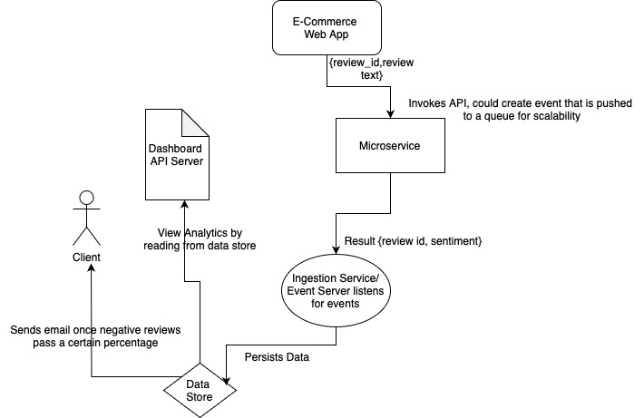

### Installation Instructions
## Prerequisites
- Docker

Build and run the image with the following command
```
docker-compose up --build -d
```

Create a get request with the following body:
```
http://0.0.0.0:8000/analyze_sentiment

{
  "review_id": "ABC3200XCVCXSDFSDFSN",
  "review_text": "Efficient and Helpful. Would recommend 10/10"
}
```

A successful response would look like this:
{
  "review_id": "ABC3200XCVCXSDFSDFSN",
  "details": {
    "label": "POSITIVE",
    "score": 0.9997965693473816
  }
}

### Testing
A few tests have been defined to test the endpoint against various edge cases in tests.py.
The dependency, the model itself, has been mocked
To run the tests, use the following command:
```
pytest -v tests.py
```
If they have passed, the following logs are printed to the console
```
collected 5 items                                                                                                                                                                  

tests.py::test_analyze_sentiment_success PASSED                                                                                                                              [ 20%]
tests.py::test_analyze_sentiment_missing_field PASSED                                                                                                                        [ 40%]
tests.py::test_analyze_sentiment_empty_field PASSED                                                                                                                          [ 60%]
tests.py::test_analyze_sentiment_processing_error PASSED                                                                                                                     [ 80%]
tests.py::test_analyze_sentiment_invalid_json PASSED                                                                                                                         [100%]
```

## Design

### Goals
- Scalable and able to handle high volumes of requests within 24 hours
- Client able to view statistics in an aggregated manner

### Assumptions
1. Data heterogeneity: Reviews from various platforms may have different formats, but
we assume that they have a unified structure, or have a review ID at the very least
2. All reviews are written in English
3. All reviews either represent positive or negative sentiments - no neutral or mixed reviews
4. Text limited to 200 words

### System Architecture:


Data Acquisition Layer:
- A service or the web application itself would invoke the analyze sentiment API.
  The job should run asynchronously and no result is returned to the service.  

Processing Layer (implemented here):
- To handle a large throughput of 10000 a day, the analyze function and API endpoint itself
is written asynchronously to prevent operations from blocking the execution thread and reduce latency.
- Ideally this microservice can be scaled and self-replicated as the requests increase
- This example returns the analysis result back to the caller. However, it would make more sense
in practice to post an event containing the results when the processing is complete, to a downstream
service to be consumed (via a broker or real time message queue)

Storage and Data Pipeline Layer 
- The service that consumes the event posted by the processing layer would also ensure that the data is 
persisted somewhere (a database) and purged after a set amount of time. A review ID is crucial so 
that the client would be able to reference a negatively reviewed product.
- A real time data streaming software such as Kafka would be ideal

BI Layer
- Since the results are to be analyzed within 24 hours, the client would ideally like to visualize this
in a dashboard. A service would read from the database/storage layer and display the results.
- The service might also perform BI tasks to visualize statistics, etc
- Once a high number of negative sentiments (past a preset threshold) arise from a certain product, an event
should be triggered to notify the client (email)

### Tech Stack
- Programming Language: Python 
  Though Go is consistently faster, Python (and FastAPI) is chosen for its ML capabilities and ease of use
- ML Framework: Torch and Huggingface LLM Sentiment Analysis Model
  - can be fine-tuned on custom datasets, allowing for adaptation to specific domains 
  - well established community and ecosystem
- Machine Learning (deep learning )Method chosen over Rule Based Method
  - superior performance and accuracy due to being able to handle more complex language